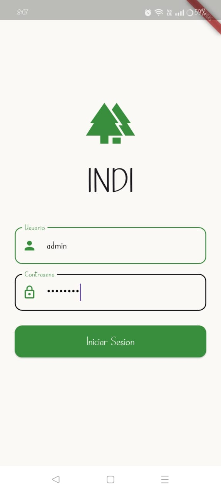
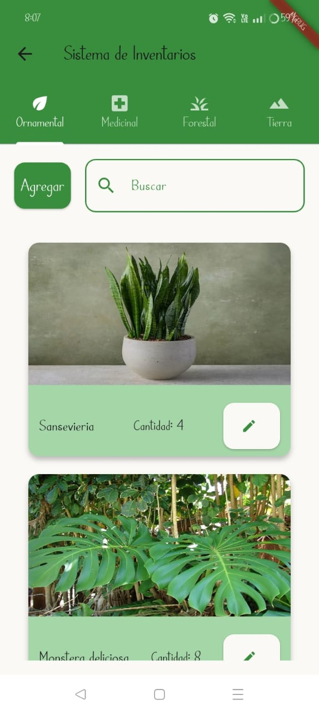
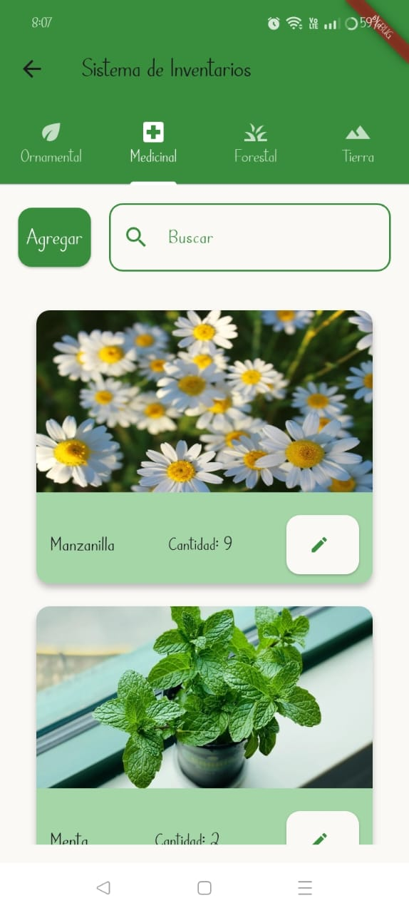
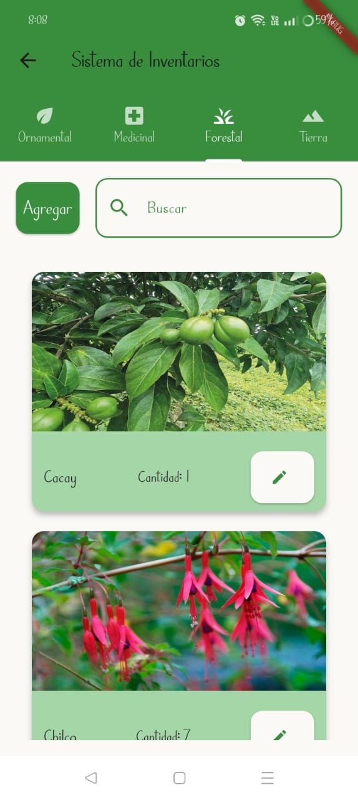
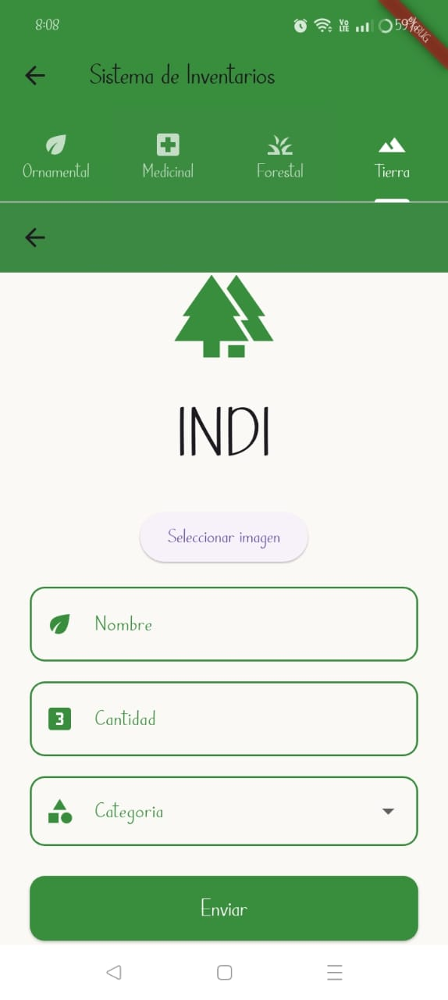

# Plant Inventory Management System 

A modern inventory system designed to **track, manage, and monitor plants** across nurseries, botanical gardens, or agricultural projects. With a clean interface and smart categorization, this system makes it easy to maintain plant data and track quantities.

---

## 📦 Core Features

- Add, edit, and categorize plant species  
- Quantity  

---

## 📊 Smart Monitoring Dashboard

- Visual summaries of species diversity  
- Charts showing plant counts by category or zone  

---

## 🛠️ Technologies Used

- **Node.js** / **Express**  
- **MongoDB**
- **Flutter**

---

## 🌿 Why It Matters

Keeping track of plant inventories is crucial for **sustainable gardening, research, and conservation**. This system empowers staff and caretakers to stay organized, reduce loss, and promote healthy ecosystems.

---

## 📗 “To plant a garden is to believe in tomorrow.” – Audrey Hepburn

## Interface Images

